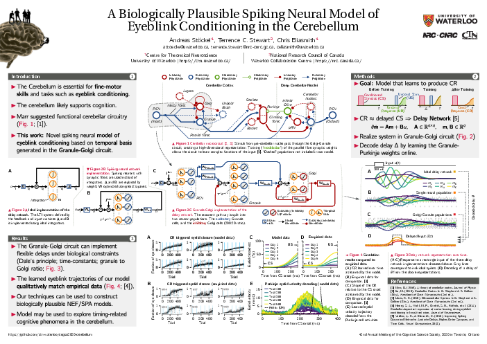

# Nengo Cerebellum Model for CogSci 2020



*Andreas Stöckel, Terry Stewart, Chris Eliasmith*

Nengo model of the cerebellum presented as a poster at the 42nd Annual Meeting of the Cognitive Science Society, 2020 (CogSci).

* **Link to the presentation video:**  
  https://www.youtube.com/watch?v=vynNYvTUAHo

* **Link to the paper:**  
  http://compneuro.uwaterloo.ca/files/publications/stoeckel.2020a.pdf

* **Link to the poster:**  
  http://compneuro.uwaterloo.ca/files/publications/stoeckel.2020a.poster.pdf

## About the code

The code in this repository is the exact codebase used to produce the results presented in the paper. To re-run the experiments, please make sure that a version of [NengoBio](https://github.com/astoeckel/nengo-bio) from the beginning of February 2020 is installed.

The code to execute and visualise the experiments can be found in the `notebooks` folder, the model itself is located in the `model` folder.

## Bibliography entry

```bib
@inproceedings{stoeckel2020biologically,
    title={A Biologically Plausible Spiking Neural Model of Eyeblink
           Conditioning in the Cerebellum},
    author={Andreas St\"ockel and Terrence C. Stewart and Chris Eliasmith},
    booktitle={42nd Annual Meeting of the Cognitive Science Society},
    year={2020},
    pages={1614--1620},
    publisher={Cognitive Science Society},
    address={Toronto, ON},
}
```
