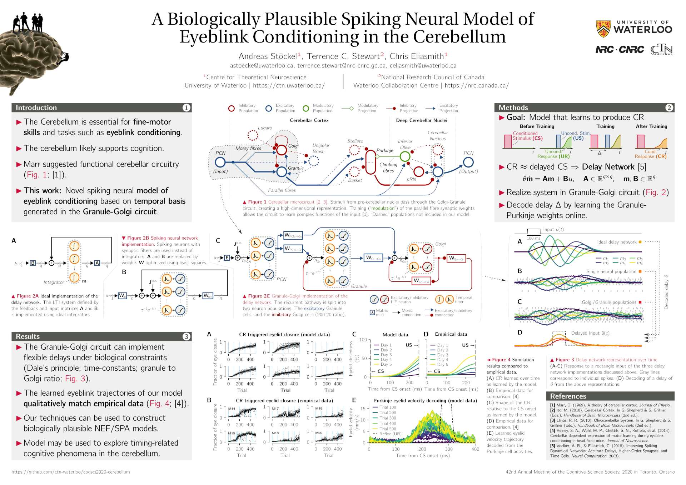

# Nengo Cerebellum Model for CogSci 2020



*Andreas Stöckel, Terry Stewart, Chris Eliasmith*

Nengo model of the cerebellum presented as a poster at the 42nd Annual Meeting of the Cognitive Science Society, 2020 (CogSci).

* **Link to the presentation video:**  
  https://www.youtube.com/watch?v=vynNYvTUAHo

* **Link to the paper:**  
  http://compneuro.uwaterloo.ca/files/publications/stoeckel.2020a.pdf

* **Link to the poster:**  
  http://compneuro.uwaterloo.ca/files/publications/stoeckel.2020a.poster.pdf

## About the code

The code in this repository is the exact codebase used to produce the results presented in the paper. To re-run the experiments, please make sure that a version of [NengoBio](https://github.com/astoeckel/nengo-bio) from the beginning of February 2020 is installed.

The code to execute and visualise the experiments can be found in the `notebooks` folder, the model itself is located in the `model` folder.

## Docker Container

To reproduce the results from the paper you can use the provided `Dockerfile` to enter a reproducible environment.
After installing `docker` on your system, execute the following from the root directory of this repository:
```
docker build -t cerebellum .
docker run -p 4567:4567 -it cerebellum
```
This will start a Jupyter lab instance inside the docker container; open the displayed URL (e.g., `http://127.0.0.1:4567/lab?token=...`) in your browser.
Open `notebooks/Run Model.ipynb` and select `Restart Kernel and Run All Cells` from the `Kernel` menu. Depending on your system, this might take a while (approximately one hour).
Now open the `notebooks/Plot - Results - Basic.ipynb` notebook; again, select `Restart Kernel and Run All Cells` from the `Kernel` menu. The displayed plots should be very similar to those found in the paper.

Note that `pytry` does not sort the individual trials deterministically; you may have to select a different trial for the final plot (e.g. by replacing `data[1]` with `data[i]` where `i` is between zero and five).

**Important:**  
The experiment results are stored inside the temporary Docker container; once you close the container instance, any changes are most likely gone. You can try to convince Docker docker to mount a directory (comment out the `ADD` line in the `Dockerfile`; use `docker run -v "$PWD:/cogsci2020-cerebellum:rw,z" -p 4567:4567 -it cerebellum`) on the host machine, but I was not able to get this to work reliably with Jupyter lab due to file permission issues.

## Bibliography entry

```bib
@inproceedings{stoeckel2020biologically,
    title={A Biologically Plausible Spiking Neural Model of Eyeblink
           Conditioning in the Cerebellum},
    author={Andreas St\"ockel and Terrence C. Stewart and Chris Eliasmith},
    booktitle={42nd Annual Meeting of the Cognitive Science Society},
    year={2020},
    pages={1614--1620},
    publisher={Cognitive Science Society},
    address={Toronto, ON},
}
```
